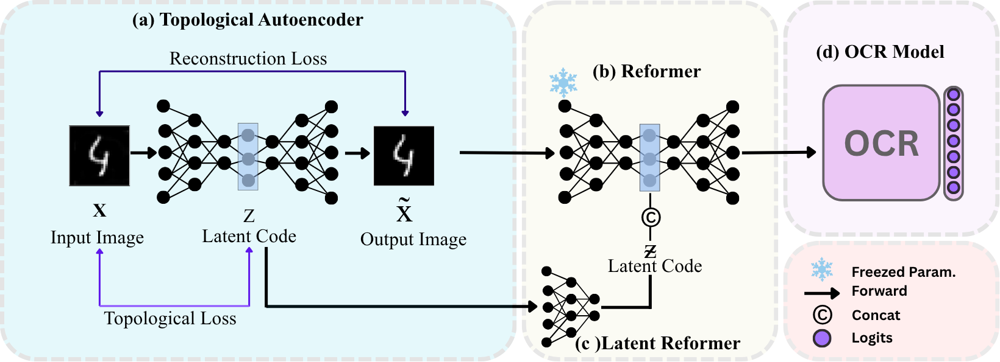

# TopoReformer

This repository provides the official implementation of TopoReformer from the
following papers.

**TopoReformer: Topological Purification for Vision and OCR Robustness**
Bhagyesh Kumar*, A S Aravinthakashan*, Akshat Satyanarayan*, Ishaan Gakhar, Ujjwal VermaPaper: https://arxiv.org/abs/2205.14135



Setup

```bash
pip install -r requirements.txt 
```

## Topological Autoencoder

```bash
dataset = "MNIST" # MNIST, EMNIST, SYN

python -m exp.train_model -F test_runs with experiments/train_model/best_runs/dataset/TopoRegEdgeSymmetric.json device='cuda' evaluation.save_training_latents=True
```
