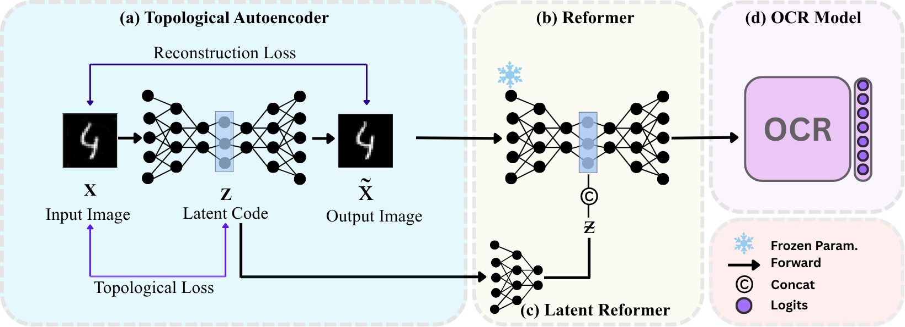

# TopoReformer  
This repository provides the official implementation of TopoReformer from the
following paper.

**TopoReformer: Mitigating Adversarial Attacks Using Topological Purification in OCR Models**  
Bhagyesh Kumar*, A S Aravinthakashan*, Akshat Satyanarayan*, Ishaan Gakhar, Ujjwal Verma  

---


Run
```bash
git clone https://github.com/invi-bhagyesh/TopoReformer
cd TopoReformer
git checkout aravinth
```

Setup

```bash
pip install -r requirements.txt 
```

## Topological Autoencoder
To train the Topological Autoencoder, select the dataset and run:

```bash
dataset = "MNIST" # Choose the dataset to train -> MNIST, EMNIST, SYN

python -m exp.train_model -F test_runs with experiments/train_model/best_runs/dataset/TopoRegEdgeSymmetric.json device='cuda' evaluation.save_training_latents=True
```

## OCR
Pretrained OCR model weights available at [Hugging Face](https://huggingface.co/datasets/invi-bhagyesh/ocr/tree/main/models)  

To generate FAWA attack on an OCR model, change Transformation, FeatureExtraction, SequenceModelling, and Prediction according to the type of model being used and run:

```bash
str_model_path = "/kaggle/input/invi_str_model/pytorch/default/9/CRNN_VGG_BiLSTM_CTC_model.pth" # provide path to the model
output_path = /kaggle/working/output # provide output path
!python watermark/baselines/fawa.py \
  --root data/protego/test \
  --save_attacks output_path \
  --iter_num 2000 \
  --eps 0.157 \
  --alpha 0.05 \
  --str_model str_model_path \
  --Transformation None \
  --FeatureExtraction VGG \
  --SequenceModeling BiLSTM \
  --Prediction CTC
```

# Generate Adaptive Attacks
To generate Adaptive attacks, provide `--attack` and `--dataset`
```bash
python -m scripts.combined.attack --attack atk_type
```

# Acknowledgement
- This repo is partially based on [Protego](https://github.com/Ruby-He/ProTegO), [Topological Autoencoders](https://github.com/BorgwardtLab/topological-autoencoders).
- The Pretrained OCR models are provided by [Protego](https://github.com/Ruby-He/ProTegO).
